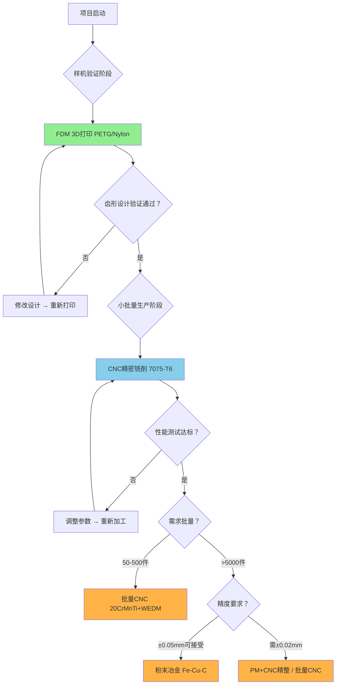

# 非圆齿轮制造工艺正向推导报告（三链路版）

> **项目背景**：15W级手摇驱动非圆齿轮系统，中心距80mm，节曲线半径30-50mm，齿宽20mm。
>
> **推导思路**：行业调研 → 力学计算 → 提炼材料性能需求 → 三条工艺链路（样机验证/小批量/量产）→ 综合对比决策。
>
> **三链路覆盖**：
> - **链路一**：样机验证 — FDM 3D打印（快速迭代、低成本验证齿形）
> - **链路二**：小批量生产 — CNC精密铣削7075-T6（性能样机、满载测试）
> - **链路三**：量产 — 粉末冶金/压铸/批量CNC（规模化交付）

---

## 一、文献与行业调研

### 1.1 非圆齿轮制造方法综述

非圆齿轮（Non-Circular Gear, NCG）是一种节曲线为非圆形的特殊齿轮，其每个齿的渐开线参数随转角连续变化。这一特性使其制造工艺与常规圆柱齿轮有本质差异。

**常规圆柱齿轮加工方法及对非圆齿轮的适用性：**

| 加工方法 | 原理 | 适用齿形 | 对非圆齿轮适用性 | 原因 |
|---------|------|---------|-----------------|------|
| **滚齿** | 滚刀与工件连续展成 | 圆柱直/斜齿轮 | ❌ **不适用** | 标准滚刀按固定齿形切削，非圆齿轮每齿参数不同 |
| **插齿** | 插齿刀往复运动+展成 | 内外直齿轮 | ⚠️ 受限 | 需专用CNC插齿机配合非圆节曲线联动控制（专利CN104816045A） |
| **成形铣削** | 成形刀具逐齿切削 | 任意齿形 | ✅ 适用 | CAM按节曲线逐段生成刀路，可加工任意非圆齿廓 |
| **线切割(WEDM)** | 钼丝放电蚀除 | 任意轮廓 | ✅ 适用 | 无切削力，任意轮廓，不受材料硬度限制 |
| **磨削** | 砂轮磨削齿面 | 高精度齿轮 | ❌ 不经济 | 非圆齿轮每齿不同，需逐齿修整砂轮，成本极高 |
| **3D打印** | 逐层增材堆积 | 任意复杂形状 | ✅ 适用 | 可直接从CAD模型生成实体，适合样机快速验证 |
| **粉末冶金(PM)** | 金属粉末压制+烧结 | 中小模数齿轮 | ✅ 适用 | 需定制模具，适合大批量（≥5000件） |

> **调研来源**：上海交通大学期刊《非圆齿轮数控加工程序的自动生成》；FastPreci《CNC齿轮加工：哪种方法最适合您的齿轮？》；知乎专栏《小模数齿轮的加工方法有哪些？》

**非圆齿轮制造的核心矛盾：**
```
非圆齿轮节曲线连续变化 → 每个齿的渐开线参数不同
  → 无法使用标准展成刀具（滚齿刀、剃齿刀）
  → 只能依靠"自由曲线"加工方式：
     - CNC铣削（CAM逐段刀路）
     - 线切割（任意轮廓放电加工）
     - 3D打印（直接成形）
     - 粉末冶金（定制模具压制）
```

### 1.2 手摇发电机齿轮制造的行业实践

通过调研手摇发电机相关专利（CN102447348A）、商业产品和教学实验器材，发现手摇发电机齿轮制造的行业实践如下：

| 应用场景 | 齿轮类型 | 材料 | 制造工艺 | 特点 |
|---------|---------|------|---------|------|
| 教学实验器材 | 塑料直齿轮 | ABS/尼龙 | 注塑成型 | 低成本、大批量、精度要求低 |
| 手摇充电器/手电 | 金属增速齿轮组 | 黄铜/锌合金 | 粉末冶金/压铸 | 体积小、转速高、量产成本低 |
| 应急手摇收音机 | 塑料行星齿轮组 | POM/尼龙 | 注塑 | 低噪音、自润滑 |
| 老式磁石电话机 | 金属齿轮增速箱 | 钢/黄铜 | 铣削+滚齿 | 全金属齿轮、扭矩大 |
| 手摇发电机专利(CN102447348A) | 多级变速齿轮 | 未明确 | 推测为冲压/注塑 | 带离合器结构 |

**行业调研结论：**

1. **商业手摇发电机普遍采用塑料齿轮（注塑POM/尼龙）或锌合金压铸齿轮**，原因是功率低（通常5-20W），力学要求极低，成本敏感
2. **非圆齿轮在手摇发电机领域的应用极为罕见**——这恰恰是本项目的创新点所在
3. **齿轮模数通常为0.5-2.0mm**，属于小模数齿轮范畴，加工方法涵盖滚齿、铣齿、插齿、线切割、3D打印、粉末冶金等
4. 本项目模数1.0mm，处于小模数齿轮范围内，上述所有工艺均可考虑

### 1.3 非圆齿轮的特殊制造约束总结

| 约束编号 | 约束内容 | 对工艺选择的影响 |
|---------|---------|----------------|
| C1 | 每齿渐开线参数不同 | 排除标准展成法（滚齿、剃齿） |
| C2 | 节曲线连续变化，齿廓为自由曲线 | CAM必须逐段生成刀路，加工时间较长 |
| C3 | 中心距80mm，节曲线半径30-50mm | 工件尺寸适中，需控制装夹变形 |
| C4 | 传动比精度决定发电稳定性 | 齿形精度要求高（≤±0.02mm） |
| C5 | 样机阶段需快速迭代 | 不开模，设计修改必须灵活 |

---

## 二、设计参数确认

### 2.1 几何与工况参数

> 数据来源：`工艺推导/齿轮材料与CNC工艺正向推导分析(1).md` 设计规格书

| 参数 | 数值 | 来源 |
|------|------|------|
| 中心距 | 80 mm | 设计图纸 |
| 节曲线半径 | 30-50 mm | 设计图纸 |
| 齿宽 | 20 mm | 设计图纸 |
| 输入功率 | 15 W（手摇驱动） | 设计规格书 |

> **注**：当前FDM样机验证阶段使用的齿轮为5:1传动比、中心距60mm的设计（G1: 100齿/r≈50mm, G2: 20齿/r≈10mm，模数1.0mm），该数据仅用于样机验证链路。小批量与量产阶段的工艺参数基于上表的80mm中心距设计。


*▲ 图1：当前FDM样机使用的非圆齿轮对预览（5:1传动比，中心距60mm）。小批量与量产齿轮参数以设计规格书的80mm中心距、30-50mm节曲线半径为准。*

### 2.2 制造精度要求

| 参数 | 数值 | 说明 |
|------|------|------|
| 尺寸精度 | ±0.02 mm | 保证非圆齿轮啮合质量与传动比精度 |
| 表面粗糙度 | Ra ≤ 0.8 μm | 减少磨损与噪声，提高传动效率 |
| 齿形精度 | ≤ 0.02 mm | 非圆齿轮节曲线精度要求极高 |

### 2.3 力学需求（正向计算结果）

从15W功率、模数1.0mm、节曲线半径10-50mm正向计算得出的力学需求：

| 参数 | 数值 | 说明 |
|------|------|------|
| 屈服强度需求 | ≥ 16.1 MPa | 保证齿根不发生塑性变形 |
| 弯曲疲劳强度需求 | = 10.2 MPa | 齿根反复弯曲应力需求 |
| 接触疲劳强度需求 | = 288.6 MPa | 齿面赫兹接触应力需求（**最严苛项**） |
| 硬度需求 | = 115.4 HB | 配合接触疲劳的硬度下限 |

> **关键发现**：15W手摇驱动的力学需求极低。接触疲劳288.6 MPa是唯一的筛选瓶颈；屈服和弯曲疲劳需求极低，几乎所有结构材料都满足。

---

## 三、工艺链一：样机验证 — FDM 3D打印

### 3.1 工艺选择理由

样机验证阶段的核心目标是**快速、低成本地验证非圆齿轮齿形设计的正确性**——确认传动比曲线是否符合预期、啮合是否顺畅、有无干涉。此阶段不需要满足最终件的力学强度和耐久性，因此选择FDM 3D打印。

**当前样机参数**（仅适用于本链路）：

| 参数 | 当前FDM样机 | 最终设计规格 |
|------|-----------|------------|
| 中心距 | 60 mm | 80 mm |
| 传动比 | 5:1 | 按设计规格书 |
| 驱动轮节曲线半径 | ~50 mm | 30-50 mm |
| 从动轮节曲线半径 | ~10 mm | — |
| 模数 | 1.0 mm | 按设计规格书 |

> 当前FDM样机为5:1传动比设计，用于验证非圆齿轮的啮合可行性和传动比变化趋势。后续小批量与量产阶段的参数以80mm中心距设计规格为准。

**FDM选择逻辑：**

```
样机验证需求分析：
  目标：验证齿形设计 → 需要从CAD到实物的快速转化
  力学：15W低载荷 → FDM材料强度远超需求
  精度：验证传动比趋势 → 不需要达到最终件±0.02mm
  成本：学生项目 → 需要极低成本
  时间：快速迭代 → FDM可在数小时内完成

FDM优势：
  ✅ 零工装成本（无需刀具、夹具、模具）
  ✅ 直接从CAD→STL→打印，设计修改零成本
  ✅ 校园/实验室普遍配备FDM设备
  ✅ 材料成本低（PLA/PETG约50-100元/kg）
```

### 3.2 FDM材料选型

| 材料 | 抗拉强度(MPa) | 弯曲模量(GPa) | 热变形温度(°C) | 收缩率(%) | 打印难度 | 成本(元/kg) | 推荐用途 |
|------|-------------|-------------|--------------|---------|---------|-----------|---------|
| **PLA** | 50-65 | 3.0-3.5 | 55-60 | 0.3-0.5 | ★☆☆ 最易 | 40-80 | 几何验证、外观展示 |
| **ABS** | 40-50 | 2.0-2.5 | 95-105 | 0.5-1.0 | ★★★ 需热床 | 50-100 | 功能测试（需丙酮后处理） |
| **PETG** | 45-55 | 2.0-2.5 | 70-80 | 0.2-0.4 | ★★☆ 中等 | 60-120 | **推荐：兼顾强度与打印性** |
| **尼龙(PA6/PA12)** | 70-85 | 2.5-3.0 | 75-160 | 0.5-1.5 | ★★★ 需干燥 | 150-300 | **推荐：最佳力学性能** |
| **TPU** | 20-40 | 0.01-0.1 | 50-60 | 0.2-0.5 | ★★☆ 慢速 | 100-200 | 不推荐（弹性体不适合齿轮） |

**推荐方案：**
- **首选 PETG**：兼顾强度、耐温、打印便利性，成本适中，适合功能验证
- **备选 Nylon（PA12）**：如需更高力学性能和耐磨性，但打印需严格干燥
- **PLA 仅用于纯几何验证**：如只验证传动比曲线和啮合关系，PLA最容易打印

### 3.3 FDM打印工艺参数推导

| 参数 | 推荐值 | 说明 |
|------|--------|------|
| 层高 | 0.12-0.20 mm | 较低层高提高齿面质量，0.15mm为平衡点 |
| 喷嘴直径 | 0.4 mm（标准） | 可选0.25mm提高细节，但打印时间显著增加 |
| 喷嘴温度 | PETG: 230-250°C / PA: 240-260°C | 按材料推荐范围设定 |
| 热床温度 | PETG: 70-80°C / PA: 70-90°C | 防止翘曲 |
| 填充率 | ≥80% | 保证齿轮整体力学强度 |
| 填充图案 | 立方体/陀螺体 | 各向同性填充 |
| 壳层数 | ≥4层 | 提高齿面表面质量和力学性能 |
| 打印速度 | 30-50 mm/s | 降低速度提高精度 |
| 打印方向 | 齿轮轴竖直，齿面水平朝上 | 使齿面与层线平行，获得最佳齿面质量 |
| 支撑 | 最少化，避免齿面支撑 | 齿轮轴竖直放置可避免齿面需支撑 |

**当前5:1样机 G1（100齿大轮）打印时间估算：**
```
工件尺寸：约106mm直径 × 20mm厚度（当前样机参数）
层高0.15mm → 约133层
填充80% + 4壳层
估计打印时间：6-8小时（PETG）
```

**当前5:1样机 G2（20齿小轮）打印时间估算：**
```
工件尺寸：约21mm直径 × 20mm厚度
估计打印时间：1-2小时（PETG）
```

### 3.4 FDM精度分析

根据Xometry行业数据及嘉立创3D打印规格：

| 参数 | FDM典型精度 | 项目需求 | 差距 | 评估 |
|------|-----------|---------|------|------|
| 尺寸公差 | ±0.3mm（100mm以内） | ±0.02mm | **15倍** | ❌ 不满足，但样机可接受 |
| 层厚分辨率 | 0.05-0.30mm | — | — | 齿面可见层纹 |
| 最小特征尺寸 | 0.4mm（推荐0.8mm） | 模数1.0mm齿厚~1.57mm | ✅ 满足 | 齿形可解析 |
| 表面粗糙度 | Ra 8-25μm | Ra ≤ 0.8μm | **10-30倍** | ❌ 需后处理 |

**精度差距分析：**

```
FDM vs 需求对比：

  尺寸精度：FDM ±0.3mm  vs  需求 ±0.02mm
    → FDM精度仅为需求的1/15
    → 但：样机验证阶段的目的是验证"传动比趋势"而非"精确传动比"
    → ±0.3mm误差下，非圆齿轮的传动比变化趋势依然可观测
    → 结论：FDM精度足以验证齿形设计方向，但不足以替代最终精密加工

  表面粗糙度：FDM Ra 8-25μm  vs  需求 Ra ≤ 0.8μm
    → FDM粗糙度为需求的10-30倍
    → 摩擦损失会高于最终件
    → 但样机阶段主要验证啮合可行性，效率测试在CNC件上进行
```

### 3.5 后处理流程

```
FDM后处理步骤：

  1. 去除支撑结构          → 手工/钳子，避免损伤齿面
  2. 打磨齿面毛刺          → 细砂纸(400-800目)，去除层纹峰
  3. 可选：化学蒸汽平滑    → 仅限ABS（丙酮蒸汽），提升表面质量
  4. 可选：喷涂表面涂层    → 透明漆/环氧树脂，填充层纹
  5. 轴孔精修              → 钻头/铰刀扩孔至精确尺寸
  6. 装配验证              → 检查啮合间隙、转动顺畅性
  7. 空载传动测试          → 手动旋转验证传动比变化趋势
```

### 3.6 成本与周期估算

| 项目 | G1（大轮） | G2（小轮） | 合计 |
|------|-----------|-----------|------|
| 材料成本 | ~15元（PETG） | ~3元 | ~18元 |
| 设备折旧 | ~5元 | ~2元 | ~7元 |
| 后处理人工 | ~1小时 | ~0.5小时 | ~1.5小时 |
| **打印时间** | 6-8小时 | 1-2小时 | **7-10小时** |
| **总周期** | — | — | **1天（含后处理）** |
| **单套总成本** | — | — | **~30-50元** |

### 3.7 优缺点总结

| 维度 | 评估 |
|------|------|
| ✅ **优势** | |
| 速度 | 最快——从CAD到实物仅数小时，支持快速迭代 |
| 成本 | 最低——单套仅30-50元，零工装投入 |
| 设计自由度 | 最高——任意修改零成本，可直接打印非圆齿廓 |
| 设备门槛 | 最低——桌面级FDM打印机即可 |
| ❌ **劣势** | |
| 精度 | 远低于需求——±0.3mm vs ±0.02mm，差距15倍 |
| 表面质量 | 层纹明显——Ra 8-25μm，需后处理改善 |
| 力学性能 | 低于金属——PETG抗拉强度~50MPa（但远超16.1MPa需求） |
| 耐久性 | 低——不适合长期运行测试 |
| 适用阶段 | **仅适合样机验证**，不可替代最终制造 |

---

## 四、工艺链二：小批量生产 — CNC精密铣削

### 4.1 工艺选择理由

小批量生产阶段（1-50件）的核心目标是**制造满足精度要求的性能样机**——进行满载效率测试、耐久性测试和最终性能评估。此阶段需要达到±0.02mm精度和Ra≤0.8μm表面粗糙度。

**CNC精密铣削选择逻辑：**

```
小批量生产需求：
  精度：±0.02mm → CNC铣削铝可达±0.01mm（超出2倍）
  粗糙度：Ra≤0.8μm → CNC精铣铝可达Ra≤0.4μm（超出2倍）
  数量：1-50件 → 不开模，CNC直接编程加工
  非圆齿廓 → CAM逐段刀路，铣削是唯一可行切削方式
```

### 4.2 材料选型：7075-T6

沿用现有报告的力学正向推导结论，7075-T6在小批量场景下为最优选择：

| 验证项 | 需求 | 7075-T6能力 | 裕度 | 判定 |
|--------|------|-----------|------|------|
| 屈服强度 | ≥16.1 MPa | 505 MPa | 31× | ✅ |
| 弯曲疲劳 | ≥10.2 MPa | 159 MPa | 16× | ✅ |
| 接触疲劳 | ≥288.6 MPa | ~375 MPa | 1.3× | ✅ |
| 硬度 | ≥115.4 HB | HB 150 | 1.3× | ✅ |
| CNC铣削精度 | ±0.02mm | ±0.01mm | 2× | ✅ |
| 精铣Ra | ≤0.8μm | ≤0.4μm | 2× | ✅ |

> **为什么选7075-T6而非钢材？**
> - 15W手摇载荷下，7075-T6裕度1.3×，处于通用齿轮安全系数推荐范围（S_H ≥ 1.0-1.3）
> - 7075-T6无需热处理，T6态直接加工——**零热变形风险**
> - 铝合金易切削，刀具寿命长，加工成本仅为钢材的1/2-1/3
> - 密度2.81 g/cm³（仅为钢的36%），轻量化优势明显
> - 小批量无需考虑长期耐磨，7075-T6完全胜任

### 4.3 工艺方式排除推导

| 工艺 | 排除原因 |
|------|---------|
| ❌ 滚齿 | 非圆齿轮每齿渐开线参数不同，标准滚齿刀只能加工圆柱齿轮 |
| ❌ 磨削 | 非圆齿轮每齿不同需逐齿修整砂轮，成本爆炸；且铝合金磨削易堵塞砂轮 |
| ⚠️ 线切割 | 理论可行，但7075-T6硬度仅HB 150，CNC铣削效率更高；线切割优势在于硬材料精加工 |
| ✅ **CNC精密铣削** | CAM按节曲线逐段生成刀路→任意非圆齿廓；铝合金易切削→精度高表面好；无需模具→小批量直接加工 |

### 4.4 CNC工艺路线

```
工序  内容                       关键参数                      设备
──────────────────────────────────────────────────────────────────
 1   采购7075-T651板/棒料       预拉伸消应力态                供应商直采
 2   下料（水切/锯切）          单边留2-3mm余量               水刀/带锯
 3   基准面铣削+定位孔          铣平面，钻中心定位孔          3轴CNC
 4   外轮廓粗铣                 硬质合金立铣刀，留0.3mm       3轴CNC
 5   齿槽逐段粗铣               CAM按节曲线生成刀路，留0.3mm  3轴CNC
 6   翻面校正                   修正基准，控制厚度公差        3轴CNC
 7   齿廓半精铣                 单边留0.1mm                   3+2轴CNC
 8   齿廓精铣【核心工序】       小径立铣刀(φ3-6mm)，小切深    3+2/五轴CNC
                               → ±0.01mm / Ra ≤ 0.4μm
 9   中心孔/轴承位              钻→铰→镗，保证同轴度         3轴CNC
10   齿顶齿根孔边倒角           C0.3倒角                     手工/CNC
11   去毛刺+超声波清洗          清除铝屑和切削液残留          超声清洗机
12   可选：硬质阳极氧化         膜厚25-50μm，HV400-600       阳极氧化线
     （进一步提升耐磨耐腐蚀）
13   可选：润滑涂层             MoS₂或PTFE降低摩擦           涂覆
14   三坐标/轮廓扫描检测        齿形精度、孔位、同轴度        CMM
15   装配 → 空载阻力 → 啮合噪声测试
```

### 4.5 精度分析

| 精度指标 | 7075-T6 CNC铣削能力 | 项目需求 | 裕度 |
|---------|-------------------|---------|------|
| 尺寸精度 | ±0.01mm | ±0.02mm | **2×** |
| 表面粗糙度 | Ra ≤ 0.4μm | Ra ≤ 0.8μm | **2×** |
| 齿形精度 | ≤0.01mm | ≤0.02mm | **2×** |

> CNC精密铣削7075-T6的精度和表面质量均**超出需求2倍**，有充足工艺裕度。

### 4.6 成本与周期估算

| 项目 | 估算 |
|------|------|
| 材料费（7075-T651） | ~50-80元/件（含损耗） |
| CNC加工费 | ~150-300元/件（含编程分摊） |
| 后处理（阳极氧化等） | ~30-50元/件 |
| 检测费 | ~50元/件 |
| **单件总成本** | **~300-500元/件** |
| **总周期** | **1-2周**（含采购、加工、后处理、检测） |

### 4.7 优缺点总结

| 维度 | 评估 |
|------|------|
| ✅ **优势** | |
| 精度 | 超出需求2倍——±0.01mm vs ±0.02mm |
| 表面质量 | 超出需求2倍——Ra≤0.4μm vs Ra≤0.8μm |
| 无热变形 | 7075-T6无需热处理，一次装夹完成精加工 |
| 成本可控 | 无模具投入，适合1-50件小批量 |
| 交期快 | 1-2周，远快于钢材方案（3-4周） |
| ❌ **劣势** | |
| 接触疲劳裕度有限 | 1.3×裕度，不适合电机驱动等高载荷场景 |
| 耐磨性一般 | 铝合金硬度HB150，长期运行齿面可能磨损 |
| 不适合大批量 | 单件加工模式，>50件成本优势消失 |

---

## 五、工艺链三：量产 — 粉末冶金/压铸/批量CNC

### 5.1 量产场景定义与工艺选择

量产阶段（>500件）的核心目标是**以最低单件成本实现规模化交付**。此时需要考虑开模投资和单件成本之间的平衡。

**非圆齿轮量产的工艺约束：**

```
非圆齿轮量产的核心难题：
  标准滚齿不适用 → 不能用最经济的量产齿轮工艺
  → 必须选择"自由曲线"量产方案：
    方案A：粉末冶金(PM)——定制模具压制烧结
    方案B：压铸——定制模具压铸成型
    方案C：批量CNC——数控铣削批量化
```

### 5.2 方案A：粉末冶金(PM)

#### 5.2.1 工艺原理与材料选择

粉末冶金是将金属粉末在模具中高压压制后高温烧结成型的工艺。适合中小模数齿轮的大批量生产。

| 项目 | 参数 |
|------|------|
| 推荐材料 | Fe-2%Cu-0.8%C 烧结钢（MPIF Standard 35） |
| 烧结密度 | 6.8-7.2 g/cm³（致密度>90%） |
| 烧结后硬度 | HB 150-250（可渗碳淬火至HRC 40-55） |
| 接触疲劳强度 | ~350-600 MPa（取决于密度和热处理） |
| 屈服强度 | ~300-500 MPa |

**力学验证（Fe-2%Cu-0.8%C 烧结钢）：**

| 需求 | 烧结钢能力 | 裕度 | 判定 |
|------|-----------|------|------|
| 接触疲劳 ≥ 288.6 MPa | ~350-600 MPa（烧结态/热处理后） | 1.2-2.1× | ✅ |
| 硬度 ≥ 115.4 HB | HB 150-250 | 1.3-2.2× | ✅ |

#### 5.2.2 工艺路线

```
粉末冶金工艺路线：

  1. 粉末配料混合     → Fe粉+Cu粉+石墨粉+润滑剂按配比混合
  2. 模具设计制造     → 定制非圆齿轮阴模（型腔按节曲线设计）
                      → 模具寿命：5万-10万件
  3. 压制成型         → 自动压机，压力200-600 MPa
                      → 非圆齿轮需多截面分层压制
  4. 烧结             → 网带炉，1120-1150°C，保护气氛，30-60min
  5. 精整/整形        → 模具整形，提高精度和表面质量
  6. 可选：渗碳淬火   → 提高表面硬度和耐磨性
  7. 可选：浸油       → 含油自润滑
  8. 检测             → 齿形精度、密度、硬度
```

#### 5.2.3 精度与限制

| 参数 | 粉末冶金典型值 | 项目需求 | 评估 |
|------|-------------|---------|------|
| 尺寸精度 | ±0.05-0.10mm | ±0.02mm | ⚠️ 需二次精加工 |
| 表面粗糙度 | Ra 1-3μm | Ra ≤ 0.8μm | ⚠️ 需精整改善 |
| 模具限制 | 斜齿螺旋角≤15° | 直齿非圆 | ✅ 可行 |
| 壁厚限制 | ≥1.5mm | 模数1.0齿厚~1.57mm | ⚠️ 接近下限 |

> **精度缺口分析**：粉末冶金精度（±0.05-0.10mm）无法直接满足±0.02mm需求，需增加CNC精整工序。这会增加单件成本，但总体仍远低于全CNC方案。

#### 5.2.4 成本分析

| 项目 | 估算 |
|------|------|
| 模具费（非圆齿轮定制模具） | 30,000-80,000元/套 |
| 单件粉末成本 | ~2-5元 |
| 压制+烧结 | ~3-8元/件 |
| 精整/CNC精修 | ~10-30元/件 |
| **单件成本（1000件）** | ~45-123元/件（含模具摊销） |
| **单件成本（5000件）** | ~18-30元/件（含模具摊销） |
| **单件成本（10000件）** | ~12-20元/件（含模具摊销） |
| 经济起订量 | ≥5000件 |

### 5.3 方案B：压铸

#### 5.3.1 材料选择

| 材料 | 牌号 | 特点 | 适用性 |
|------|------|------|--------|
| 锌合金 | Zamak 3/5 | 熔点低(~390°C)、流动性好、精度高 | ✅ 最适合小模数齿轮压铸 |
| 铝合金 | ADC12 | 通用压铸铝合金、成本低 | ⚠️ 收缩率较大 |

**Zamak 3 锌合金参数：**

| 参数 | 数值 |
|------|------|
| 抗拉强度 | 280-330 MPa |
| 屈服强度 | 220-250 MPa |
| 硬度 | HB 82-91（可镀铬提高表面硬度） |
| 密度 | 6.6 g/cm³ |
| 收缩率 | 0.6-0.8% |
| 压铸精度 | ±0.05-0.15mm |

**力学验证（Zamak 3）：**

| 需求 | Zamak 3能力 | 裕度 | 判定 |
|------|-----------|------|------|
| 屈服 ≥16.1 MPa | 220-250 MPa | 14-16× | ✅ |
| 接触疲劳 ≥288.6 MPa | 需表面处理 | — | ⚠️ 需镀铬或镀镍 |
| 硬度 ≥115.4 HB | HB 82-91 | ❌ | 需表面硬化 |

> **压铸方案需表面硬化处理**才能满足接触疲劳需求。可增加镀铬（HV 800-1000）或化学镀镍层。

#### 5.3.2 工艺路线

```
压铸工艺路线：

  1. 模具设计制造     → 定制非圆齿轮压铸模（钢模）
                      → 模具寿命：10万-30万模次
  2. 压铸成型         → 热室压铸机，锌合金浇注温度400-420°C
  3. 去浇口/飞边      → 冲切或铣削
  4. 可选：CNC精铣    → 齿廓精整至±0.03mm
  5. 表面硬化处理     → 镀铬/化学镀镍
  6. 检测             → 齿形精度、表面质量
```

#### 5.3.3 成本分析

| 项目 | 估算 |
|------|------|
| 压铸模具费 | 50,000-120,000元/套 |
| 单件压铸成本 | ~3-8元/件 |
| CNC精整 | ~10-25元/件 |
| 表面处理 | ~5-15元/件 |
| **单件成本（1000件）** | ~68-168元/件（含模具摊销） |
| **单件成本（5000件）** | ~25-55元/件（含模具摊销） |
| **单件成本（10000件）** | ~16-35元/件（含模具摊销） |
| 经济起订量 | ≥5000件 |

### 5.4 方案C：批量CNC（20CrMnTi）

#### 5.4.1 材料与工艺

对于50-500件的中间批量，开模不经济，纯CNC单件成本又高。此时可采用**批量CNC方案**，使用20CrMnTi钢材提升耐久性。

| 项目 | 参数 |
|------|------|
| 材料 | 20CrMnTi 渗碳钢 |
| 热处理 | 渗碳淬火（表面HRC 58-62，心部HRC 30-45） |
| 接触疲劳 | ~1200-1400 MPa |
| 工艺路线 | 软态CNC粗铣→渗碳淬火→线切割精修齿廓→研磨孔位 |

#### 5.4.2 成本分析

| 项目 | 估算 |
|------|------|
| CNC粗铣（正火态） | ~200-400元/件 |
| 渗碳淬火热处理 | ~80-150元/件 |
| 线切割精修 | ~150-300元/件 |
| 研磨+防锈+检测 | ~50-100元/件 |
| **单件总成本** | **~500-1000元/件** |
| 总周期 | 3-4周 |

### 5.5 量产方案对比

| 维度 | 方案A：粉末冶金 | 方案B：压铸 | 方案C：批量CNC |
|------|--------------|-----------|--------------|
| 材料 | Fe-Cu-C烧结钢 | Zamak 3锌合金 | 20CrMnTi渗碳钢 |
| 模具费 | 3-8万 | 5-12万 | 无 |
| 单件成本(1000件) | 45-123元 | 68-168元 | 500-1000元 |
| 单件成本(5000件) | 18-30元 | 25-55元 | 400-800元 |
| 单件成本(10000件) | 12-20元 | 16-35元 | 350-700元 |
| 精度(直接) | ±0.05-0.10mm | ±0.05-0.15mm | ±0.005mm（线切割后） |
| 是否需精整 | 是 | 是 | 否 |
| 经济起订量 | ≥5000件 | ≥5000件 | ≥10件 |
| 接触疲劳 | 350-600 MPa | 需表面处理 | 1200-1400 MPa |
| 适用批量 | **>5000件大批量** | **>5000件大批量** | **50-500件中批量** |

> **推荐策略**：
> - **50-500件**：批量CNC（20CrMnTi），无需开模，精度最高
> - **500-5000件**：需综合评估，CNC成本随批量下降有限，考虑PM
> - **>5000件**：粉末冶金或压铸，模具摊薄后单件成本最优

---

## 六、三链路综合对比与决策

### 6.1 总对比表

| 对比维度 | 链路一：FDM样机验证 | 链路二：CNC小批量 | 链路三：量产 |
|---------|-------------------|-----------------|------------|
| **适用批量** | 1-5件 | 1-50件 | >50件 |
| **材料** | PETG/Nylon | 7075-T6铝合金 | 烧结钢/Zamak/20CrMnTi |
| **核心工艺** | FDM熔融沉积 | CNC精密铣削 | PM压制烧结/压铸/批量CNC+WEDM |
| **尺寸精度** | ±0.3mm | ±0.01mm | PM:±0.05mm / WEDM:±0.005mm |
| **表面粗糙度** | Ra 8-25μm | Ra ≤0.4μm | PM:Ra 1-3μm / WEDM:Ra≤0.4μm |
| **是否满足精度需求** | ❌（差距15×） | ✅（超出2×） | PM:⚠️需精整 / WEDM:✅ |
| **单件成本** | ~30-50元 | ~300-500元 | PM:12-30元 / CNC:500-1000元 |
| **模具/工装投入** | 0元 | 0元 | PM:3-8万 / 压铸:5-12万 |
| **总周期** | 1天 | 1-2周 | PM:4-8周(含开模) / CNC:3-4周 |
| **设计迭代成本** | ≈0（重新打印） | 中（重新编程） | 高（重新开模） |
| **力学裕度(接触疲劳)** | PETG:❌ / Nylon:⚠️ | ✅ 1.3× | PM:✅ 1.2-2.1× / 20CrMnTi:✅ 4.2× |
| **耐久性** | 低（数小时-数天） | 中（数百小时） | 高（数万小时） |
| **轻量化** | 最好(1.2-1.4g/cm³) | 好(2.81g/cm³) | 中(6.6-7.8g/cm³) |

### 6.2 决策路径图



### 6.3 推荐策略

| 阶段 | 推荐方案 | 理由 |
|------|---------|------|
| **阶段一：当前** | FDM 3D打印（PETG） | 验证非圆齿轮啮合可行性和传动比曲线，零工装成本，1天内完成 |
| **阶段二：下一步** | 7075-T6 + CNC精密铣削 | 制造性能样机，进行满载效率测试和耐久性评估，精度超出需求2倍 |
| **阶段三：未来** | 视批量选择：50-500件用20CrMnTi批量CNC；>5000件用PM | PM方案模具投资大但单件成本最低；批量CNC无模具投入但单件成本较高 |

### 6.4 从样机到量产的升级路径

```
升级路径一览：

  FDM验证 → 确认齿形设计正确 → CNC性能样机 → 确认力学性能达标

  ┌────────────────────────────────────────────────────────────┐
  │                                                            │
  │   FDM (PETG)        CNC (7075-T6)         量产方案         │
  │   ┌────────┐        ┌────────┐         ┌────────┐        │
  │   │ ±0.3mm │   →    │±0.01mm │    →    │视批量选│        │
  │   │ Ra 15μm│        │Ra 0.4μm│         │择方案  │        │
  │   │ ~50元  │        │~400元  │         │12-1000│        │
  │   │ 1天    │        │1-2周   │         │3-8周  │        │
  │   └────────┘        └────────┘         └────────┘        │
  │    验证齿形          验证性能           规模化交付          │
  │                                                            │
  └────────────────────────────────────────────────────────────┘
```

---

## 附录A：材料性能参考表

| 参数 | PLA | PETG | Nylon(PA12) | 7075-T6 | 40CrNiMoA | 20CrMnTi | 17-4PH | Fe-Cu-C烧结钢 | Zamak 3 |
|------|-----|------|-------------|---------|-----------|----------|--------|-------------|---------|
| 抗拉强度(MPa) | 50-65 | 45-55 | 70-85 | 570 | 980-1080 | ≥1080 | 1310 | 350-500 | 280-330 |
| 屈服强度(MPa) | — | — | — | 505 | 835 | ≥835 | 1170 | 300-500 | 220-250 |
| 硬度 | — | — | — | HB150 | HB280-320 | HRC58-62 | HRC40-45 | HB150-250 | HB82-91 |
| 疲劳极限(MPa) | — | — | — | 159 | 400-450 | 550-650 | 400-480 | — | — |
| 密度(g/cm³) | 1.24 | 1.27 | 1.01 | 2.81 | 7.85 | 7.80 | 7.78 | 6.8-7.2 | 6.6 |
| 热处理 | 无 | 无 | 无 | T6（已到位） | 调质+渗碳 | 渗碳淬火 | 固溶+时效 | 可渗碳淬火 | 镀铬 |
| 参考价(元/kg) | 40-80 | 60-120 | 150-300 | 80-150 | 15-25 | 10-18 | 60-100 | 15-30 | 18-30 |

## 附录B：调研资料来源

| 编号 | 来源 | 链接 | 主要参考内容 |
|------|------|------|------------|
| 1 | CN102447348A 带有离合器的手摇发电机专利 | patents.google.com | 手摇发电机齿轮箱结构 |
| 2 | 知乎专栏：小模数齿轮的加工方法 | zhuanlan.zhihu.com/p/1931854236997621581 | 小模数齿轮加工方法分类 |
| 3 | 知乎专栏：齿轮制造中的冶金工艺 | zhuanlan.zhihu.com/p/615604942 | 粉末冶金齿轮工艺详解 |
| 4 | FastPreci：CNC齿轮加工方法比较 | fastpreci.com/zh-CN/blog/cnc-gear-cutting | CNC齿轮加工精度与工艺选择 |
| 5 | Xometry：3D打印中的公差 | xometry.asia/zh-hans/tolerances-in-3d-printing | FDM/SLS/SLA精度数据 |
| 6 | 嘉立创：FDM尼龙3D打印 | jlc.com/portal/q7i50744 | FDM尼龙精度±0.5mm |
| 7 | 上海交通大学：非圆齿轮数控加工 | qk.sjtu.edu.cn | 非圆齿轮加工方法 |
| 8 | CN104816045A 非圆齿轮插齿加工方法专利 | patents.google.com | CNC插齿加工非圆齿轮 |
| 9 | Gear Solutions：压铸齿轮 | gearsolutions.com | 锌合金压铸齿轮量产优势 |
| 10 | ScienceDirect：齿轮制造综述 | sciencedirect.com | 齿轮制造工艺总览 |
| 11 | 知乎：手搓发电机 | zhuanlan.zhihu.com/p/648724866 | 手摇发电机齿轮选配实践 |
